1. Crear un repositorio
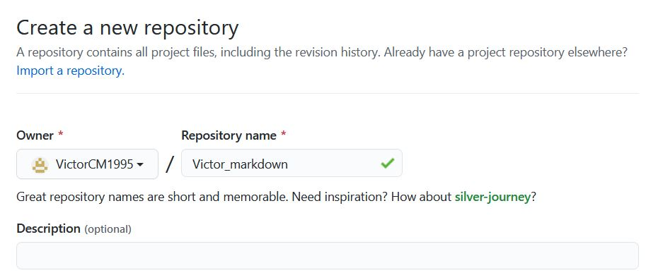

2. Clonar repositorio usando git clone https://github.com/VictorCM1995/Victor_markdown.git

3. Archivo y carpeta creados en el repositorio local
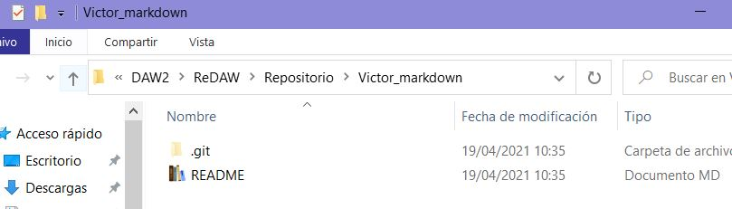

4. Añadir al README.md los comandos utilizados hasta ahora y commit inicial añadido usando git commit -m "Primer commit de Victor"
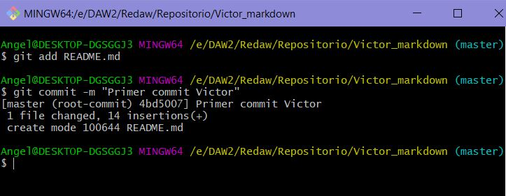
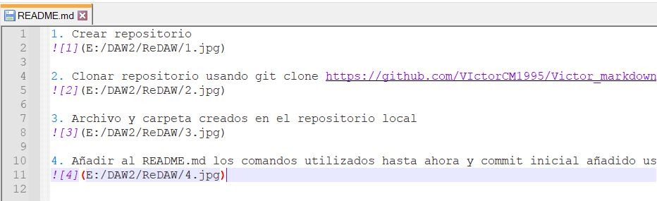
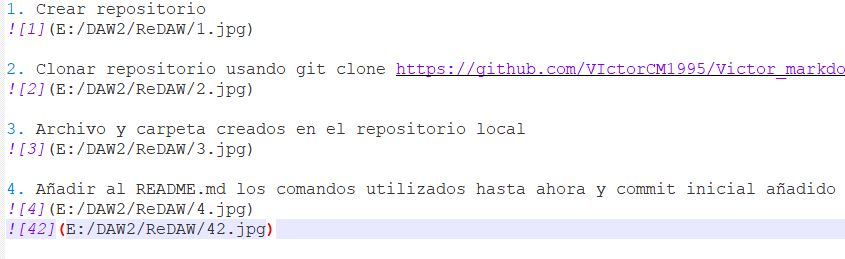

5. Cambios subidos con git push origin master
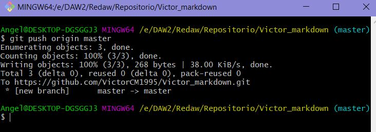

6. Crear fichero y archivo de manera manual sin subirlos
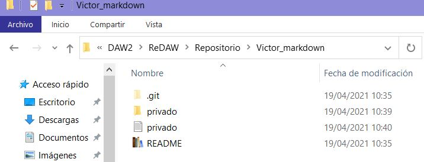

7. Ignorarlos con un nuevo fichero nano .gitignore
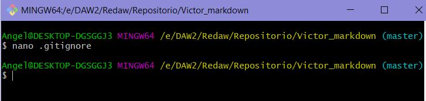
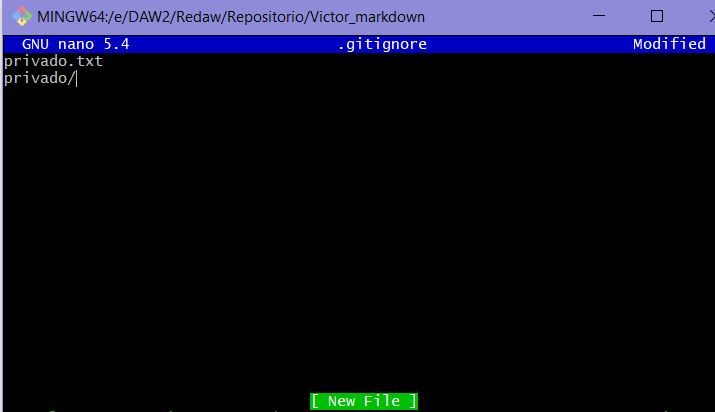
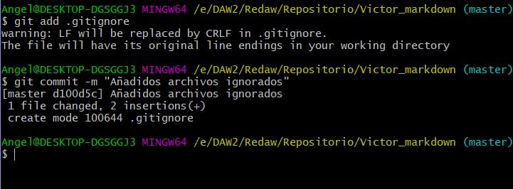

8. RESUMEN (mira las imagenes anteriores)
9. Fichero victor.md con lista de modulos
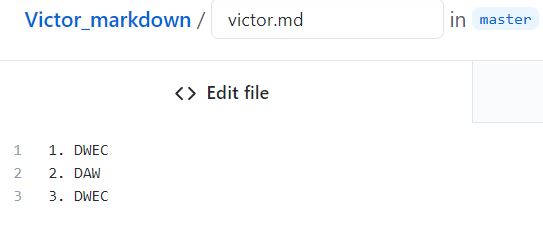

10. Crear tag con git tag v0.1
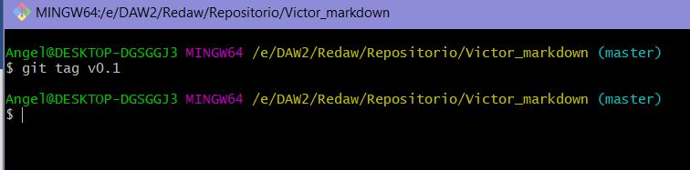

11. Subir cambios del tag anterior
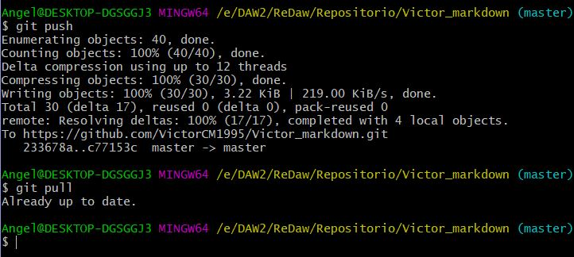

12. RESUMEN (mira los imagenes de la 9 a la 11)
13. CREAR TABLA

Persona A | Persona B
--|--
Victor | Leonardo

[Enlace a repositorio](https://github.com/VictorCM1995/Victor_markdown.git)

# MARKDOWN 3
1. Crear rama Victor con git branch Victor
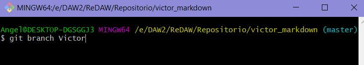

2. Posicionamiento con git checkout Victor
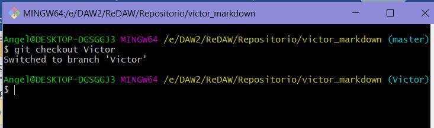

3. Crear despliegue.md
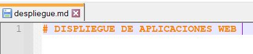

4. Commit de despliegue.md
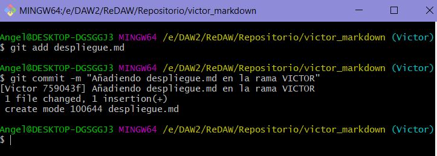

5. Subir cambios con git push origin Victor
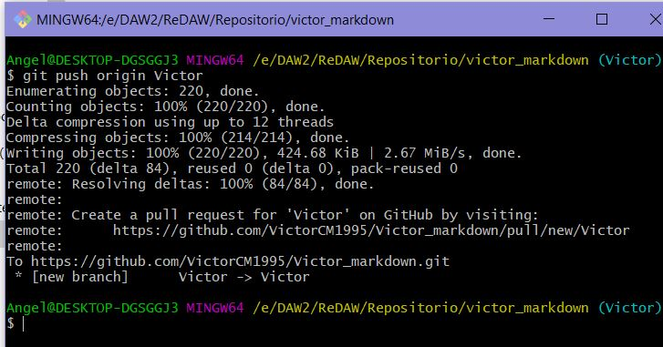

6. Posicionamiento con git checkout master
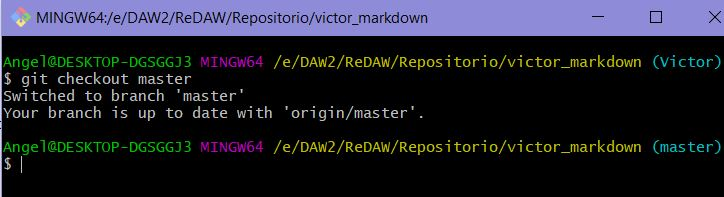

7. Fusionar con git merge Victor master
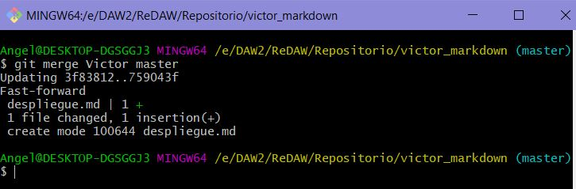

8. Modificar en master despliegue.md
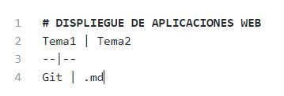

9. Commit desde master
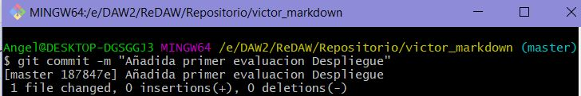

10. Posicionamiento con git checkout Victor
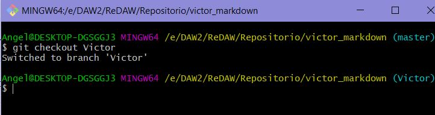

11. Modificar en Victor despliegue.md
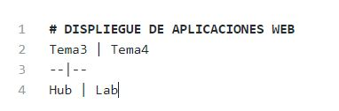

12. Commit desde Victor
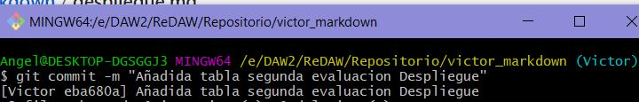

13. Posicionamiento con git checkout master y Fusion git merge Victor master (Salta el conflicto)
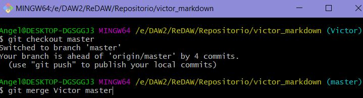

14. Arreglo
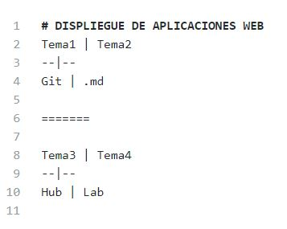

15. Crear tag con git tag v0.2
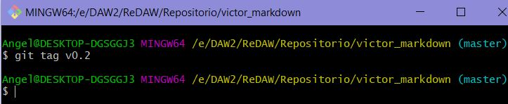

16. Borrar rama Victor con git branch -d Victor
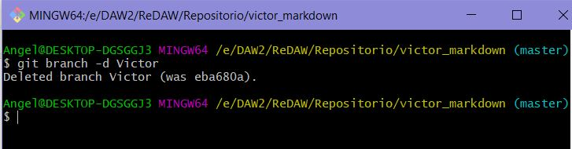

17. RESUMEN mira las imagenes anteriores
18. Cambios realizados con commit
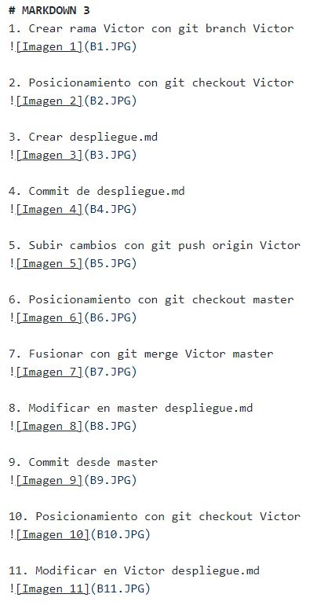
