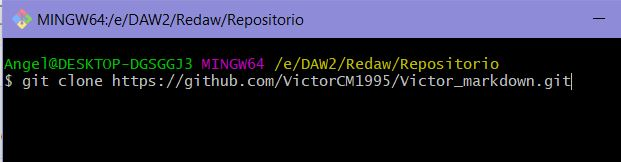

1. Crear repositorio
<<<<<<< HEAD
[IMAGEN 1](1.jpg)

2. Clonar repositorio usando git clone https://github.com/VictorCM1995/Victor_markdown.git

3. Archivo y carpeta creados en el repositorio local

4. Añadir al README.md los comandos utilizados hasta ahora y commit inicial añadido usando git commit -m "Primer commit de Victor"

=======
[Imagen1](E:/DAW2/ReDAW/1.jpg)

2. Clonar repositorio usando git clone https://github.com/VictorCM1995/Victor_markdown.git
[Imagen2](E:/DAW2/ReDAW/2.jpg)

3. Archivo y carpeta creados en el repositorio local
[Imagen3](E:/DAW2/ReDAW/3.jpg)

4. Añadir al README.md los comandos utilizados hasta ahora y commit inicial añadido usando git commit -m "Primer commit de Victor"
[Imagen41](E:/DAW2/ReDAW/4.jpg)
[Imagen42](E:/DAW2/ReDAW/42.jpg)
[Imagen43](E:/DAW2/ReDAW/42.jpg)
>>>>>>> 1c667748080b8ef5fb71534425c39289b0413b0c
